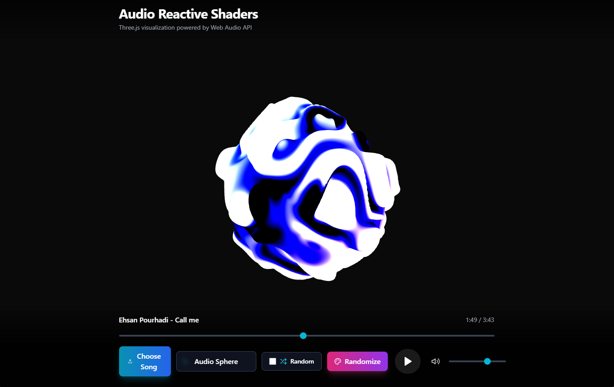
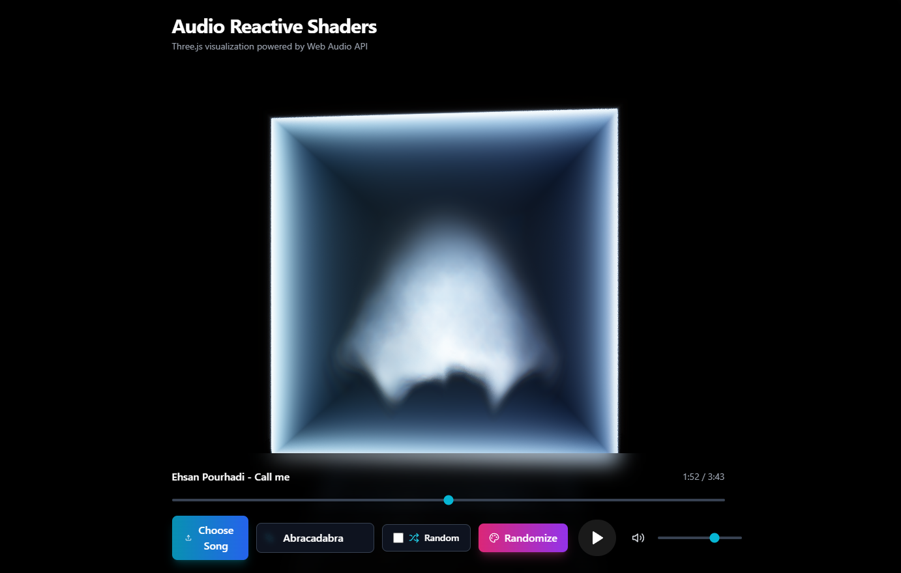

# Custom Audio Reactive Shaders

A stunning real-time audio visualization tool featuring 19 unique shader effects that react dynamically to music. Built with React, Three.js, and the Web Audio API.

## Features

- **19 Unique Shaders**: From plasma waves and fractals to galaxy simulations and particle systems
- **Real-Time Audio Analysis**: Visualizations react to frequency and amplitude data from your audio
- **Multiple Audio Sources**: Support for microphone input and audio file upload
- **Interactive Controls**: 
  - Play/pause audio
  - Adjust volume
  - Switch between shader effects
  - Randomize color schemes
  - Auto-cycle mode for shader rotation
- **Smooth Transitions**: Seamless shader switching with visual continuity
- **Responsive Design**: Full-screen immersive experience

## Demo

### Screenshots




### Video Demos

- [Demo Video 1](demo/2025-12-14%2016-06-35.mp4)
- [Demo Video 2](demo/2025-12-14%2016-08-12.mp4)
- [Demo Video 3](demo/2025-12-14%2016-09-45.mp4)

## Available Shaders

1. **Plasma** - Classic plasma effect with smooth color gradients
2. **Waveform Bars** - Traditional bar visualizer with a modern twist
3. **Particle Wave** - Flowing particle system
4. **Circular Ripples** - Concentric wave patterns
5. **Smooth Waves** - Elegant sine wave compositions
6. **Kaleidoscope** - Symmetric mirrored patterns
7. **Diamond Wave** - Geometric diamond patterns
8. **Galaxy** - Spiraling cosmic formations
9. **Voronoi** - Cell-based organic patterns
10. **Warped FBM** - Fractional Brownian motion
11. **Julia Set** - Classic fractal mathematics
12. **Audio Sphere** - 3D spherical visualizations
13. **Distorted Sphere** - Morphing sphere geometry
14. **Gyroid** - Minimal surface geometry
15. **Fractal Pyramid** - Layered fractal structures
16. **Mandelbulb Raymarch** - 3D Mandelbrot set exploration
17. **Area Mountains** - Terrain-like elevation mapping
18. **Journey Desert** - Dune-inspired landscapes
19. **Abracadabra** - Mystical energy patterns

## Technology Stack

- **React** - UI framework
- **TypeScript** - Type-safe development
- **Three.js** - 3D graphics and shader rendering
- **Web Audio API** - Real-time audio analysis
- **Vite** - Fast build tooling
- **Tailwind CSS** - Styling

## Getting Started

### Prerequisites

- Node.js (v18 or higher)
- npm or yarn

### Installation

1. Navigate to the project directory:
```bash
cd "Custom Audio Reactive Shaders"
```

2. Install dependencies:
```bash
npm install
```

3. Start the development server:
```bash
npm run dev
```

4. Open your browser and visit `http://localhost:5173`

### Building for Production

```bash
npm run build
```

The production-ready files will be in the `dist` directory.

## Usage

1. **Choose Audio Source**:
   - Click "Use Microphone" to visualize live audio
   - Or click "Upload Audio" to select a music file

2. **Control Playback**:
   - Use play/pause button
   - Adjust volume with the slider

3. **Explore Shaders**:
   - Use Previous/Next buttons to cycle through shaders
   - Click "Randomize Colors" for new color palettes
   - Enable "Auto Cycle" for automatic shader rotation every 25 seconds

## Project Structure

```
src/
├── components/
│   ├── AudioVisualizer.tsx  # Main Three.js canvas component
│   └── AudioControls.tsx    # Control panel UI
├── hooks/
│   └── useAudioAnalyzer.ts  # Audio processing logic
├── shaders/
│   ├── index.ts             # Shader registry
│   └── *.ts                 # Individual shader implementations
└── App.tsx                   # Main application component
```

## Performance Notes

- Optimized for modern browsers with WebGL 2.0 support
- Shader complexity varies - some effects are more GPU-intensive
- Recommended: Dedicated graphics card for best experience

## Browser Support

- Chrome/Edge (recommended)
- Firefox
- Safari (limited shader support)

## License

MIT

## Credits

Built with passion for audiovisual art and real-time graphics programming.
