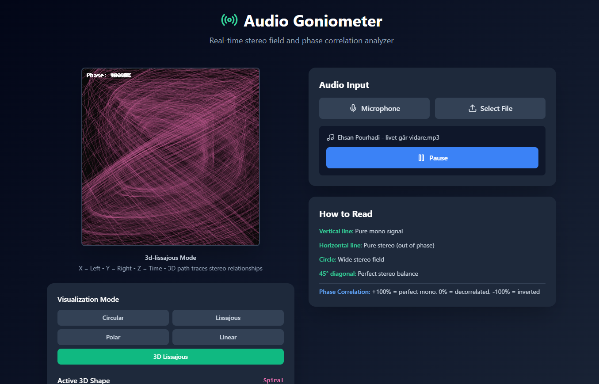
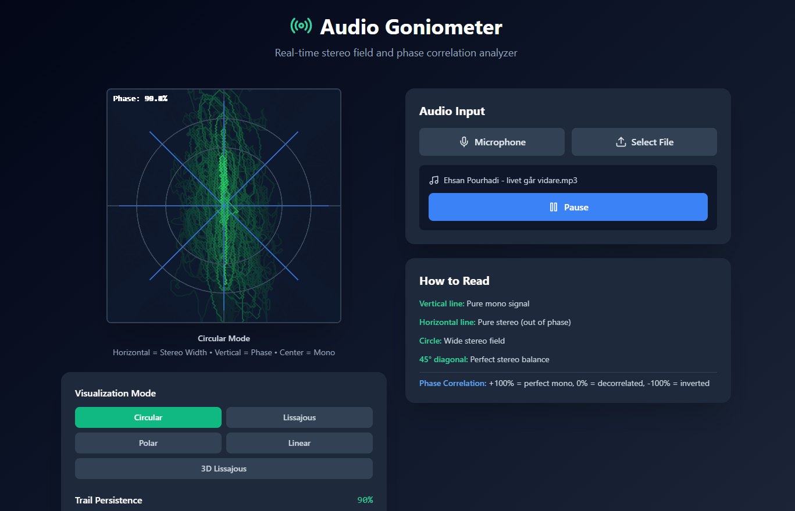

# Audio Goniometer

A professional-grade stereo field analyzer and phase correlation tool for audio engineers and producers. Visualize the spatial characteristics of your stereo audio in real-time with beautiful, interactive displays.

## Features

- **Real-Time Stereo Analysis**: Monitor left/right channel relationships instantly
- **Phase Correlation Meter**: Track mono compatibility and stereo width
- **Multiple Visualization Modes**:
  - Circular Goniometer - Classic polar display
  - Lissajous Pattern - XY phase scope
  - Vector Scope - Directional intensity mapping
- **Shape Detection**: Automatic identification of audio patterns (Lissajous curves, circles, ellipses, lines)
- **Adjustable Parameters**:
  - Gain control for optimal visualization
  - Persistence/decay settings for trail effects
  - Real-time measurement snapshots
- **Audio Source Flexibility**: Microphone input or audio file upload
- **Measurement History**: Save and review stereo field measurements via Supabase integration

## Demo

### Screenshots




### Video Demo

- [Full Demo](demo/2025-12-14%2016-17-59.mp4)

## What is a Goniometer?

A goniometer is an essential tool in audio production that displays the stereo field of your audio. It shows:

- **Stereo Width**: How spread out your audio is between left and right channels
- **Phase Correlation**: Whether your left and right channels are in sync (mono compatibility)
- **Balance**: Visual representation of panning and stereo imaging

### Key Indicators

- **Perfect Circle**: Wide stereo with good phase correlation
- **Vertical Line**: Mono signal (identical left/right)
- **Horizontal Line**: Out-of-phase stereo (mono incompatible)
- **Lissajous Curves**: Complex phase relationships

## Technology Stack

- **React** - UI framework
- **TypeScript** - Type-safe development
- **Web Audio API** - Real-time audio processing and analysis
- **Canvas API** - High-performance 2D rendering
- **Supabase** - Backend for measurement storage
- **Vite** - Development and build tooling
- **Tailwind CSS** - Modern styling

## Getting Started

### Prerequisites

- Node.js (v18 or higher)
- npm or yarn
- Supabase account (optional, for measurement history)

### Installation

1. Navigate to the project directory:
```bash
cd "React Goniometer"
```

2. Install dependencies:
```bash
npm install
```

3. (Optional) Configure Supabase:
   - Create a Supabase project
   - Update `src/lib/supabase.ts` with your credentials
   - Run migrations in `supabase/migrations/`

4. Start the development server:
```bash
npm run dev
```

5. Open your browser and visit `http://localhost:5173`

### Building for Production

```bash
npm run build
```

## Usage Guide

### Getting Started

1. **Select Audio Source**:
   - Click "Start Microphone" for live audio monitoring
   - Or click "Upload Audio File" to analyze recorded audio

2. **Choose Visualization Mode**:
   - **Circular**: Traditional goniometer display
   - **Lissajous**: XY phase scope pattern

3. **Adjust Controls**:
   - **Gain**: Increase/decrease signal amplitude (0.5x to 5x)
   - **Persistence**: Control trail decay (0.5 to 0.98)

### Reading the Display

- **Phase Correlation Meter** (top): 
  - +1.0 = Perfect mono (in phase)
  - 0.0 = Perfect stereo
  - -1.0 = Inverse phase (mono cancellation)
  
- **Detected Shape**: Shows current pattern type
- **RMS Values**: Left and right channel levels

### Saving Measurements

Click "Save Current Measurement" to store stereo field snapshots with Supabase integration.

## Project Structure

```
src/
├── components/
│   ├── AudioGoniometer.tsx  # Main visualization component
│   └── AudioControls.tsx    # Control panel UI
├── lib/
│   └── supabase.ts          # Database configuration
└── App.tsx                   # Main application
```

## Use Cases

- **Mixing & Mastering**: Monitor stereo width and phase correlation
- **Live Sound**: Check signal phase relationships in real-time
- **Audio Forensics**: Analyze stereo field characteristics
- **Education**: Learn about stereo imaging and phase
- **Quality Control**: Ensure mono compatibility

## Technical Details

- **FFT Size**: 2048 samples for smooth analysis
- **Refresh Rate**: 60 FPS canvas updates
- **Phase Calculation**: Correlation coefficient algorithm
- **Shape Detection**: Pattern recognition with confidence scoring

## Browser Support

- Chrome/Edge (recommended)
- Firefox
- Safari

## Known Limitations

- Requires modern browser with Web Audio API support
- Microphone access requires HTTPS in production
- Canvas rendering performance depends on device GPU

## License

MIT

## Credits

Inspired by professional audio analysis tools and built for the modern web audio ecosystem.
