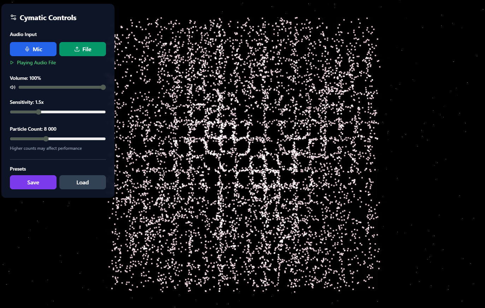

# Real-Time Sound-Reactive 3D Cymatics

Experience the mesmerizing physics of sound visualization through interactive 3D cymatic patterns. Watch as audio frequencies create stunning geometric formations inspired by Chladni plates and harmonic resonance.

## Features

- **Real-Time 3D Visualization**: Dynamic particle systems that respond to audio frequencies
- **Multiple Pattern Types**:
  - **Radial**: Circular wave patterns radiating from center
  - **Harmonic**: Musical frequency-based geometries
  - **Interference**: Wave interference patterns
  - **Chladni**: Classic Chladni plate simulations
- **Dual Display Modes**:
  - 3D Sphere visualization with rotating camera
  - 2D Chladni Plate simulation
- **Customizable Appearance**:
  - 4 color schemes: Spectral, Monochrome, Heat, Ocean
  - Wireframe mode toggle
  - Adjustable mesh resolution (16-128 segments)
- **Audio Controls**:
  - Microphone input
  - Audio file upload
  - Volume control
  - Sensitivity adjustment
- **Preset System**: Save and load your favorite configurations with Supabase integration
- **Particle Count Control**: 2,000 to 20,000 particles for performance tuning

## Demo

### Screenshots




### Video Demo

- [Full Demo Video](demo/2025-12-14%2015-57-50.mp4)
- [Animation Preview](demo/Animation.gif)

## What are Cymatics?

Cymatics is the study of visible sound and vibration. When sound frequencies pass through a medium (like particles on a plate), they create geometric patterns based on the frequency and harmonics. This tool brings that phenomenon into the digital realm with stunning 3D graphics.

### Historical Context

- **Ernst Chladni** (18th century): Pioneered visual sound with vibrating plates and sand
- **Hans Jenny** (20th century): Coined the term "Cymatics" and expanded the research
- **Modern Applications**: Music visualization, acoustic engineering, art installations

## Technology Stack

- **React** - UI framework
- **TypeScript** - Type-safe development
- **Three.js** - 3D graphics and rendering
- **React Three Fiber** - React renderer for Three.js
- **Web Audio API** - Real-time audio analysis
- **Supabase** - Preset storage and management
- **Vite** - Build tooling
- **Tailwind CSS** - Styling

## Getting Started

### Prerequisites

- Node.js (v18 or higher)
- npm or yarn
- Supabase account (optional, for presets)

### Installation

1. Navigate to the project directory:
```bash
cd "Real-Time Sound-Reactive 3D Cymatics"
```

2. Install dependencies:
```bash
npm install
```

3. (Optional) Configure Supabase:
   - Create a Supabase project
   - Update `src/lib/supabase.ts` with your credentials
   - Run migrations in `supabase/migrations/`

4. Start the development server:
```bash
npm run dev
```

5. Open your browser and visit `http://localhost:5173`

### Building for Production

```bash
npm run build
```

## Usage Guide

### Basic Controls

1. **Start Audio**:
   - Click "Start Microphone" for live audio input
   - Or "Upload Audio" to visualize a music file

2. **Adjust Sensitivity** (0.5x - 3.0x):
   - Lower values: Subtle, gentle movement
   - Higher values: Intense, dramatic response

3. **Change Pattern Type**:
   - Radial: Best for bass-heavy music
   - Harmonic: Responds to melodic frequencies
   - Interference: Creates complex layered patterns
   - Chladni: Classic nodal patterns

4. **Customize Appearance**:
   - Choose color scheme from dropdown
   - Toggle wireframe for technical look
   - Adjust segments for detail vs performance

### Advanced Features

- **Presets**: Save your configurations
  - Click "Save Preset" 
  - Name your preset
  - Reload anytime from the presets panel

- **Particle Count**: Balance visual quality with performance
  - More particles = smoother appearance
  - Fewer particles = better FPS on slower devices

- **View Modes**: Toggle between 3D sphere and 2D plate for different perspectives

## Project Structure

```
src/
├── components/
│   ├── Scene3D.tsx          # Main 3D scene wrapper
│   ├── CymaticSphere.tsx    # 3D sphere visualization
│   ├── ChladniPlate.tsx     # 2D plate simulation
│   ├── ControlPanel.tsx     # Settings UI
│   └── PresetModal.tsx      # Preset management
├── hooks/
│   ├── useAudioAnalyzer.ts  # Audio processing
│   └── usePresets.ts        # Preset CRUD operations
├── lib/
│   └── supabase.ts          # Database config
└── App.tsx                   # Main application
```

## Performance Tips

- Start with 8,000 particles and adjust based on your device
- Lower segment count (32-64) for smoother performance
- Disable wireframe for better FPS
- Close other GPU-intensive applications

## Browser Support

- Chrome/Edge (recommended for best performance)
- Firefox
- Safari (may have limited WebGL features)

## Use Cases

- **Music Visualization**: Live performances and DJ sets
- **Educational**: Demonstrate physics of sound and resonance
- **Art Installations**: Interactive audiovisual experiences
- **Meditation/Relaxation**: Calming visual feedback
- **Audio Production**: Visual reference for frequency content

## Technical Details

- **FFT Size**: 2048 samples for frequency resolution
- **Frame Rate**: 60 FPS rendering target
- **Particle System**: Custom shader-based rendering
- **3D Engine**: Three.js with React Three Fiber
- **Audio Latency**: ~20-30ms typical response time

## Known Limitations

- Requires WebGL 2.0 support
- Performance varies by GPU capability
- Microphone requires HTTPS in production
- Some mobile devices may have reduced performance

## Future Enhancements

- [ ] VR/XR support
- [ ] MIDI input control
- [ ] Export video recordings
- [ ] Additional pattern algorithms
- [ ] Real-time parameter automation

## License

MIT

## Credits

Inspired by the pioneering work of Ernst Chladni and Hans Jenny in making sound visible. Built with modern web technologies to bring cymatics to everyone's browser.
